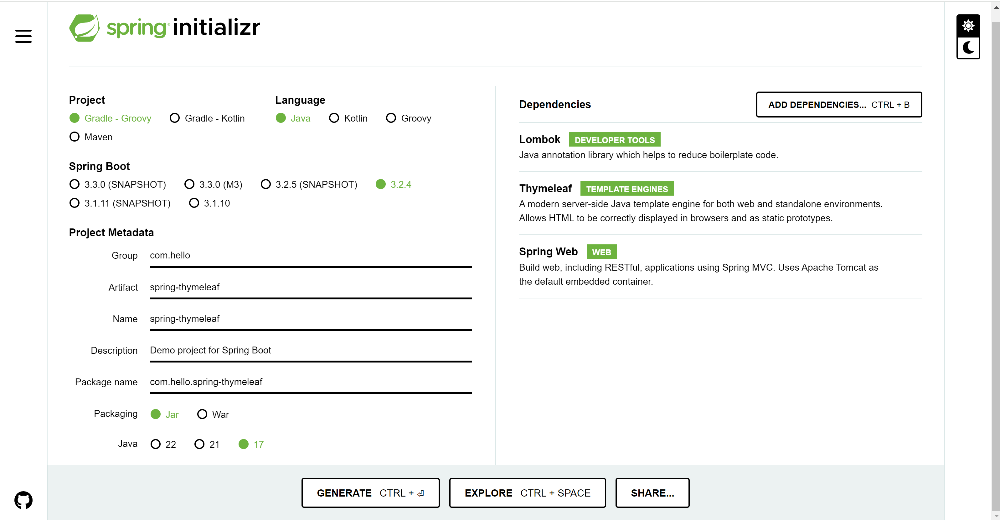

안녕하세요? 이번에는 스프링과 결합하여 쓴다면 강력한 기능들을 많이 제공해주는 타임리프에 대하여 알아보겠습니다.

백엔드를 주력으로 개발하더라도, 다룰 수 있는 템플릿 엔진이 하나쯤 있다면 간단한 게시판, 어드민 화면 등은 굉장히 쉽고 빠르게 만들 수 있고 사이드 프로젝트를 할 때 간단한 화면 UI등은 빠르게 개발할 수 있기에 타임리프를 한번 공부해둔다면 꽤나 매력적일 것 같습니다.

모든 예제 코드는 https://github.com/DevCHW/example-code 에 있습니다.

자 그럼 먼저 프로젝트 생성부터 시작해보겠습니다.

https://start.spring.io/

위 사이트에 가서 현재 날짜를 기준으로 가장 안정적인 버전 중 최신버전으로 스프링부트 버전을 선택한다음, Dependency로는 Spring Web, Lombok, Thymeleaf를 선택한 뒤 Generate 해줍니다.

